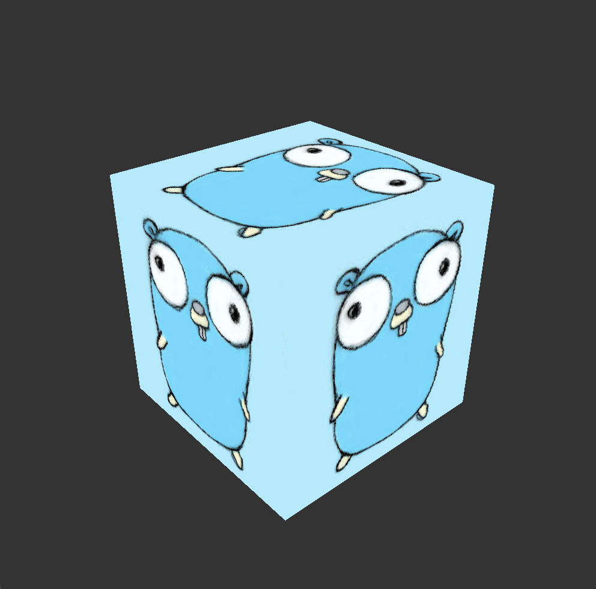

# VulkanCube



## Supported platforms

- macOS (GLFW + MoltenVK)
- TrimUI Smart Pro (Linux, SDL2 only)

## macOS

### Setup

Homebrew packages:
- `molten-vk`
- `vulkan-headers`
- `vulkan-loader`
- `vulkan-tools`
- `shaderc`
- `glfw` (for GLFW variant)
- `sdl2` (for SDL2 variant)

Optional:
- `HOMEBREW_NO_AUTO_UPDATE=1`

### Build shaders (optional)

From `/Users/$USER/code/trimui-vulkan/demos-go/vulkancube`:

```sh
make shaders
```

### Run (GLFW)

```sh
cd /Users/$USER/code/trimui-vulkan/demos-go/vulkancube/vulkancube_glfw
export DYLD_LIBRARY_PATH="/opt/homebrew/lib:$DYLD_LIBRARY_PATH"
CGO_LDFLAGS="-L/opt/homebrew/lib" go run .
```

### Run (SDL2)

```sh
cd /Users/$USER/code/trimui-vulkan/demos-go/vulkancube/vulkancube_sdl2
export DYLD_LIBRARY_PATH="/opt/homebrew/lib:$DYLD_LIBRARY_PATH"
CGO_LDFLAGS="-L/opt/homebrew/lib" go run .
```

## TrimUI Smart Pro

### Container

Only the SDL2 variant is supported. GLFW requires X11/Wayland and is not available on TrimUI.

Build inside the container (from the `vulkancube_sdl2` folder):

```sh
go build .
```

### Runtime

Uses system SDL2:

```sh
export LD_LIBRARY_PATH=/usr/trimui/lib:$LD_LIBRARY_PATH
./vulkancube_sdl2
```

### Controls (SDL2)

- `A` key / controller button A: slow down rotation
- `B` key / controller button B: speed up rotation
- controller button `5` (which=0): exit (same as `Esc`)
- key presses are logged to stdout (scancode + keycode)
