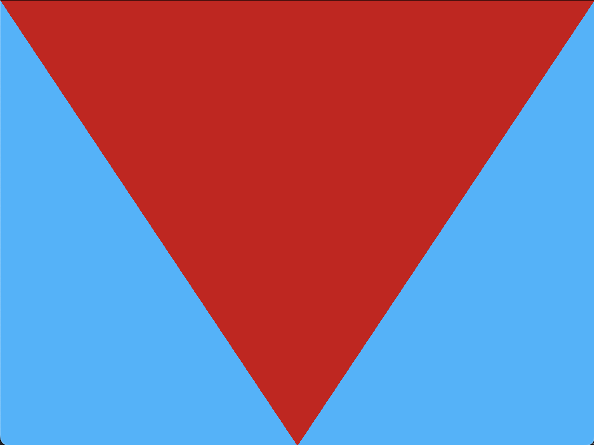

# VulkanDraw



## Supported platforms

- Linux graphics (GLFW, desktop only)
- macOS (GLFW + MoltenVK)
- TrimUI Smart Pro (Linux, SDL2 only, TODO)

## macOS

### Setup (GLFW)

Homebrew packages:
- `molten-vk`
- `vulkan-headers`
- `vulkan-loader`
- `vulkan-tools`
- `shaderc`
- `glfw`

Optional:
- `HOMEBREW_NO_AUTO_UPDATE=1`

### Build shaders (optional)

From `/Users/$USER/code/trimui-vulkan/demos-go/vulkandraw`:

```sh
make shaders
```

### Run (GLFW)

```sh
cd /Users/$USER/code/trimui-vulkan/demos-go/vulkandraw/vulkandraw_glfw
export DYLD_LIBRARY_PATH="/opt/homebrew/lib:$DYLD_LIBRARY_PATH"
CGO_LDFLAGS="-L/opt/homebrew/lib" go run .
```

## TrimUI Smart Pro

### Container

Only the SDL2 variant is supported. GLFW requires X11/Wayland and is not available on TrimUI.

Build inside the container (from the `vulkandraw_sdl2` folder):
```sh
go build .
```

### Runtime

Uses system SDL2:
```sh
export LD_LIBRARY_PATH=/usr/trimui/lib:$LD_LIBRARY_PATH
./vulkandraw_sdl2
```

### Controls (SDL2)

- controller button `5` (which=0): exit (same as `Esc`)
